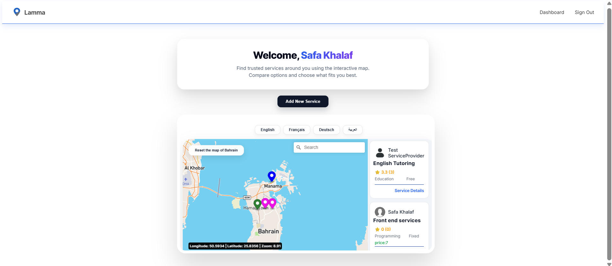
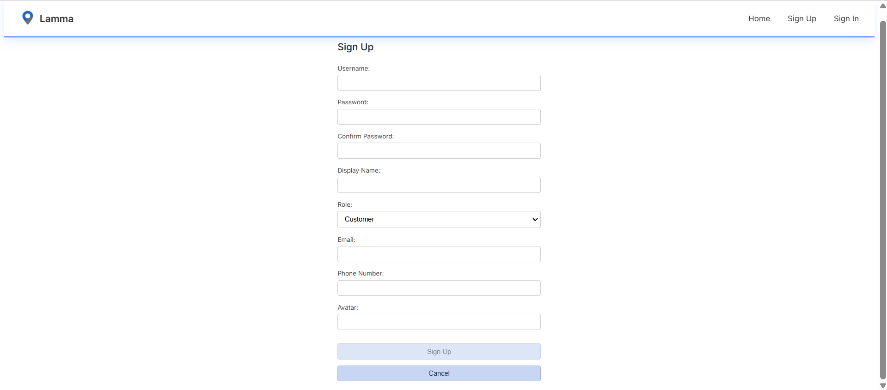
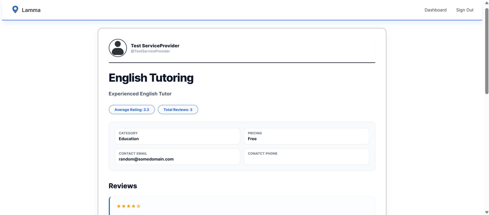

# 🗺️ Lamma
Lamma is a location-based community services platform built using RESTful conventions. It allows users to discover nearby services on an interactive map, while enabling service providers to create, manage, and receive reviews for their services.

## 🧩 About the Project
Lamma connects neighbors by allowing service providers to list services and customers to discover them using a live, interactive map. Services are displayed as map markers based on geographic coordinates, making it easy to explore what’s available nearby. Users can view service details, leave reviews, and track ratings, creating a trusted and community-driven platform.  

### Dashboard Page

### Sign up Page

### Service Details Page

## ✨ Features
- User authentication with JWT  
- Role-based access (Service Provider / Customer)  
- Create and manage services (providers only)  
- Interactive map with real-time service markers  
- Location-based service discovery  
- View detailed service information  
- Submit reviews and ratings  
- Automatic average rating calculation  
- Prevent duplicate reviews per service  
- Responsive dashboard experience  

## 📁 RESTful Routes Overview

### 🔐 Authentication
| Action | Method | Route | Description |
|--------|--------|-------|-------------|
| Sign Up | POST | `/auth/sign-up` | Create a new user account |
| Sign In | POST | `/auth/sign-in` | Authenticate user and return JWT |

### 🛠️ Services
| Action | Method | Route | Description |
|--------|--------|-------|-------------|
| All Services | GET | `/service` | Retrieve all services |
| Create Service | POST | `/service` | Create a new service (providers only) |
| Show Service | GET | `/service/:serviceId` | View service details |
| Update Service | PUT | `/service/:serviceId` | Edit a service you own |
| Delete Service | DELETE | `/service/:serviceId` | Delete a service you own |

### ⭐ Reviews
| Action | Method | Route | Description |
|--------|--------|-------|-------------|
| Add Review | POST | `/review/:serviceId` | Submit a review for a service |
| Get Reviews | GET | `/review/:serviceId` | View all reviews for a service |

---

## 🛠️ Technologies Used

### Frontend
- **React**
- **Mapbox GL JS**
- **CSS Modules**
- **Axios**

### Backend
- **Node.js**
- **Express**
- **MongoDB / Mongoose**
- **JWT Authentication**
- **RESTful API Architecture**

---

## 🔗 Backend Repository
The backend API for this project can be found here:  
👉 **[\[Backend Repository Link Here\]](https://github.com/safakhalaf026/LammaBackEnd)**

---

## 📌 Attributions
- **Maps & Geolocation**  
  https://docs.mapbox.com/help/tutorials/use-mapbox-gl-js-with-react/?step=0

- **Popup Alerts**  
  https://sweetalert2.github.io/

- **Animations**  
  https://animate.style/

---

## 🚀 Future Improvements
- Add service category filtering on the map  
- Enable search by service name or provider  
- Allow providers to upload service images  
- Implement favorites or saved services  
- Add real-time chat between users  
